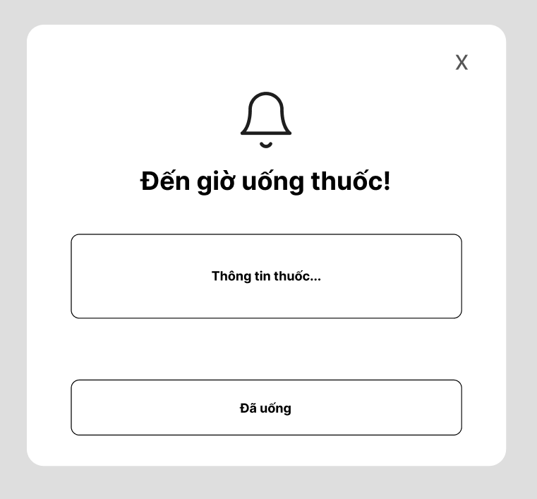
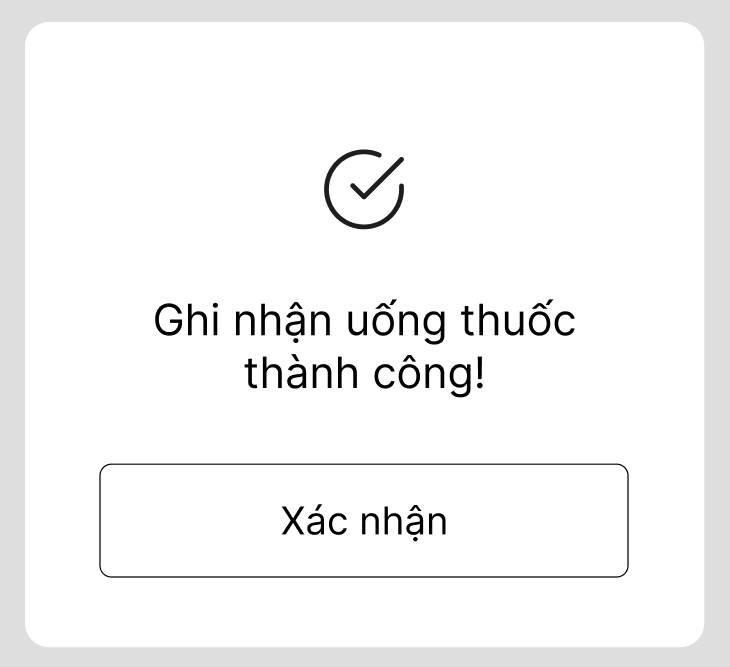

# THỰC HÀNH THIẾT KẾ TÍNH NĂNG NHẮC UỐNG THUỐC RIKKEICARE

## 1. Phân tích Use Case & Xác định yếu tố UI

### Actor

**Actor:** Bệnh nhân

Bệnh nhân là người nhận thông báo nhắc uống thuốc và thực hiện thao tác xác nhận đã uống thuốc.

### UI Element

| Yêu cầu                | UI Element   | Nội dung           |
| ---------------------- | ------------ | ------------------ |
| (a) Hiển thị tên thuốc | Text / Label | Tên thuốc cần uống |
| (b) Phản hồi           | Button       | **Đã uống**        |

Thiết kế chỉ sử dụng **1 nút phản hồi duy nhất** để giảm sự lựa chọn và giúp bệnh nhân lớn tuổi dễ thao tác.

---

## 2. Wireframe

### Khung 1 — Thông báo nhắc uống thuốc

**Mô tả:** Khi đến giờ đã hẹn, hệ thống hiển thị thông báo với tên thuốc và một nút **Đã uống**.

---

### Khung 2 — Sau khi nhấn "Đã uống"

**Mô tả:** Sau khi bệnh nhân nhấn **Đã uống**, thông báo được đóng lại và hệ thống hiển thị xác nhận **Đã ghi nhận uống thuốc**.

---

## 3. Đối chiếu với Định luật Hick

Nếu có quá nhiều nút lựa chọn như "Đã uống", "Nhắc lại", "Bỏ qua", "Hủy", "Xem chi tiết", bệnh nhân lớn tuổi sẽ phải suy nghĩ và lựa chọn nhiều hơn, dễ gây bối rối và tăng thời gian thao tác. Vì vậy, chỉ giữ một nút **"Đã uống"** giúp giao diện đơn giản, rõ ràng và dễ sử dụng hơn.

## 4. Link figma
[Rikkei Care](https://www.figma.com/design/vNW0YPktcxJM6pOb4DpYAV/RikkeiCare?node-id=0-1&t=DTYY2geOvhbBovPC-1)